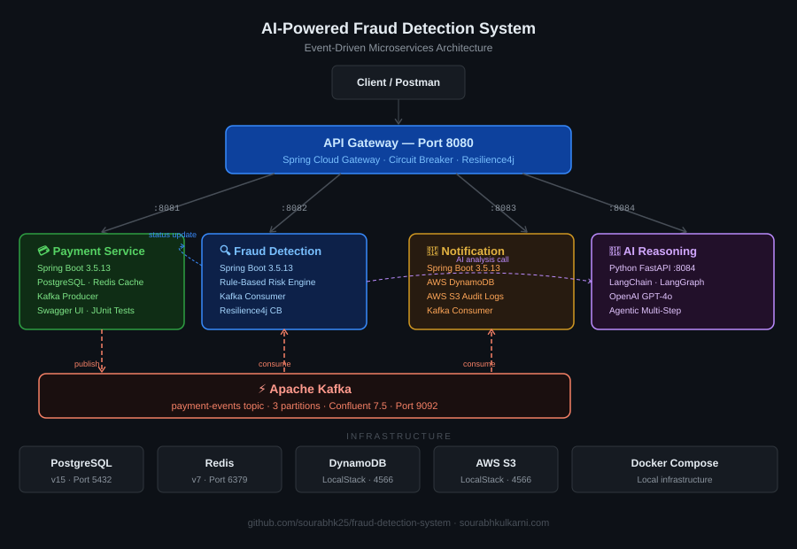

# 🔐 AI-Powered Fraud Detection System

A production-grade, event-driven microservices system for real-time payment fraud detection, powered by Java Spring Boot, Apache Kafka, and OpenAI GPT-4o with LangChain/LangGraph agentic reasoning.



---

## 🛠 Tech Stack

| Layer | Technology |
|---|---|
| **API Gateway** | Spring Cloud Gateway 2023.0.3, Resilience4j Circuit Breaker |
| **Backend Services** | Java 17, Spring Boot 3.5.13, Spring Data JPA, Maven |
| **AI / LLM** | Python 3.10, FastAPI, LangChain, LangGraph, OpenAI GPT-4o |
| **Messaging** | Apache Kafka 3.9 (Confluent), Zookeeper |
| **Databases** | PostgreSQL 15 (transactional), Redis 7 (caching) |
| **Cloud Storage** | AWS DynamoDB (alerts), AWS S3 (audit logs) via LocalStack |
| **Infrastructure** | Docker, Docker Compose, LocalStack 3.0 |
| **Documentation** | SpringDoc OpenAPI / Swagger UI |
| **Testing** | JUnit 5, Mockito, Testcontainers, MockMvc |
| **Observability** | Spring Boot Actuator, Micrometer, Structured Logging |

---

## 🚀 Services

### 1. API Gateway — Port 8080
Single entry point for all client requests. Routes to downstream services with circuit breaker protection using Spring Cloud Gateway.

### 2. Payment Service — Port 8081
Accepts payment requests via REST, validates, persists to PostgreSQL, and publishes `PaymentEventDTO` to Kafka topic `payment-events`.

**Endpoints:**
```
POST   /api/v1/payments                    Initiate new payment
GET    /api/v1/payments/{id}               Get payment by ID
GET    /api/v1/payments/sender/{senderId}  Get payments by sender
PATCH  /api/v1/payments/{id}/status        Update payment status
```

### 3. Fraud Detection Service — Port 8082
Consumes Kafka events, scores risk using rule-based engine, saves fraud alerts to PostgreSQL, and updates payment status.

**Risk Scoring Rules:**
- Amount ≥ $50,000 → +40 score
- Amount ≥ $10,000 → +20 score
- Suspicious IP prefix → +30 score
- Unknown device → +20 score
- Same sender/receiver → +50 score

**Risk Levels:** `LOW` (0–19) | `MEDIUM` (20–39) | `HIGH` (40–69) | `CRITICAL` (70+)

**Endpoints:**
```
GET  /api/v1/fraud/alerts                   All fraud alerts
GET  /api/v1/fraud/alerts/payment/{id}      Alert by payment ID
GET  /api/v1/fraud/alerts/risk/{riskLevel}  Alerts by risk level
GET  /api/v1/fraud/alerts/status/{status}   Alerts by status
```

### 4. Notification Service — Port 8083
Consumes Kafka events, stores notifications in DynamoDB, archives audit logs to S3 with date-partitioned keys.

**Endpoints:**
```
GET  /api/v1/notifications                  All notifications
GET  /api/v1/notifications/payment/{id}     Notifications by payment ID
```

### 5. AI Reasoning Service — Port 8084
Python FastAPI service with two AI analysis modes powered by OpenAI GPT-4o.

**Simple Analysis** — single LangChain LLM call for fraud explanation.

**Agentic Analysis** — LangGraph stateful multi-step reasoning:
```
assess_risk node
    ├── score ≥ 70  →  deep_analysis node    (CRITICAL/HIGH → REJECT/REVIEW)
    └── score < 70  →  standard_analysis node (LOW/MEDIUM  → APPROVE/REVIEW)
```

**Endpoints:**
```
POST  /api/v1/ai/analyze         Simple LangChain analysis
POST  /api/v1/ai/analyze/agent   LangGraph agentic analysis
GET   /health                    Health check
```

---

## 📋 Prerequisites

- Java 17+
- Maven 3.8+
- Python 3.10+
- Docker Desktop
- OpenAI API key with active credits

---

## ⚡ Quick Start

### 1. Clone the repository
```bash
git clone https://github.com/sourabhk25/fraud-detection-system.git
cd fraud-detection-system
```

### 2. Start infrastructure
```bash
docker compose up -d
```

### 3. Set up AI service
```bash
cd ai-reasoning-service
python3 -m venv venv
source venv/bin/activate
pip install -r requirements.txt
cp .env.example .env
# Edit .env and add your OpenAI API key: OPENAI_API_KEY=sk-...
```

### 4. Start all services (in separate terminals)
```bash
# Terminal 1 — Payment Service
cd payment-service && mvn spring-boot:run

# Terminal 2 — Fraud Detection Service
cd fraud-detection-service && mvn spring-boot:run

# Terminal 3 — Notification Service
cd notification-service && mvn spring-boot:run

# Terminal 4 — AI Reasoning Service
cd ai-reasoning-service && source venv/bin/activate && python main.py

# Terminal 5 — API Gateway
cd api-gateway && mvn spring-boot:run
```

---

## 🔌 Ports & URLs

| Service | Port | URL |
|---|---|---|
| API Gateway | 8080 | http://localhost:8080 |
| Payment Service | 8081 | http://localhost:8081/swagger-ui.html |
| Fraud Detection | 8082 | http://localhost:8082/swagger-ui.html |
| Notification Service | 8083 | http://localhost:8083/swagger-ui.html |
| AI Reasoning Service | 8084 | http://localhost:8084/docs |
| Kafka UI | 8090 | http://localhost:8090 |
| LocalStack (DynamoDB/S3) | 4566 | http://localhost:4566 |

---

## 🧪 End-to-End Test Flow

### Step 1 — Create a normal payment
```bash
curl -X POST http://localhost:8080/api/v1/payments \
  -H "Content-Type: application/json" \
  -d '{
    "senderId": "user-001",
    "receiverId": "user-002",
    "amount": 1500.00,
    "currency": "USD",
    "ipAddress": "192.168.1.100",
    "deviceId": "device-abc-123"
  }'
```

### Step 2 — Create a high-risk payment
```bash
curl -X POST http://localhost:8080/api/v1/payments \
  -H "Content-Type: application/json" \
  -d '{
    "senderId": "user-003",
    "receiverId": "user-999",
    "amount": 95000.00,
    "currency": "USD",
    "ipAddress": "45.33.32.156",
    "deviceId": "unknown-device-xyz"
  }'
```

### Step 3 — Check CRITICAL fraud alerts
```bash
curl http://localhost:8080/api/v1/fraud/alerts/risk/CRITICAL
```

### Step 4 — AI agentic analysis
```bash
curl -X POST http://localhost:8080/api/v1/ai/analyze/agent \
  -H "Content-Type: application/json" \
  -d '{
    "payment_id": "your-payment-id",
    "sender_id": "user-003",
    "receiver_id": "user-999",
    "amount": 95000.00,
    "currency": "USD",
    "ip_address": "45.33.32.156",
    "device_id": "unknown-device-xyz",
    "risk_score": 90.0,
    "risk_level": "CRITICAL",
    "risk_reasons": [
      "Transaction amount exceeds suspicious threshold of $50000.0",
      "Transaction originated from suspicious IP: 45.33.32.156",
      "Transaction from unknown device: unknown-device-xyz"
    ]
  }'
```

**Expected AI Response:**
```json
{
  "decision": "REJECT",
  "confidence": 0.95,
  "explanation": "Transaction exhibits multiple high-risk factors...",
  "recommended_action": "Reject and alert fraud investigation team",
  "reasoning_steps": [
    "Initial risk assessment: score=90.0, level=CRITICAL",
    "Escalating to deep analysis — high risk detected",
    "Deep analysis decision: REJECT"
  ]
}
```

---

## 🏗 Infrastructure

| Container | Image | Port |
|---|---|---|
| PostgreSQL | postgres:15-alpine | 5432 |
| Redis | redis:7-alpine | 6379 |
| Zookeeper | confluentinc/cp-zookeeper:7.5.0 | 2181 |
| Kafka | confluentinc/cp-kafka:7.5.0 | 9092 |
| Kafka UI | provectuslabs/kafka-ui:latest | 8090 |
| LocalStack | localstack/localstack:3.0 | 4566 |

---

## 📁 Project Structure

```
fraud-detection-system/
├── api-gateway/                    Spring Cloud Gateway (port 8080)
├── payment-service/                Payment REST API + Kafka producer (port 8081)
│   ├── src/main/java/
│   │   ├── controller/
│   │   ├── service/
│   │   ├── repository/
│   │   ├── kafka/
│   │   ├── model/
│   │   ├── dto/
│   │   ├── config/
│   │   └── exception/
│   └── src/test/
├── fraud-detection-service/        Kafka consumer + risk engine (port 8082)
├── notification-service/           DynamoDB + S3 notifications (port 8083)
├── ai-reasoning-service/           Python FastAPI + LangChain + LangGraph (port 8084)
│   ├── app/
│   │   ├── config/settings.py
│   │   ├── models/schemas.py
│   │   ├── routes/reasoning_routes.py
│   │   └── services/
│   │       ├── fraud_analyzer.py
│   │       └── fraud_agent.py
│   ├── main.py
│   ├── requirements.txt
│   └── .env.example
├── docker-compose.yml
└── README.md
```

---

## ☁️ AWS Deployment (Planned)

Designed for production AWS deployment via CDK:

| AWS Service | Purpose |
|---|---|
| ECS Fargate | Containerized microservices |
| MSK | Managed Kafka |
| Aurora PostgreSQL | Managed relational DB |
| ElastiCache Redis | Managed caching |
| DynamoDB | Alert storage |
| S3 | Audit log archival |
| Cognito | Authentication |
| API Gateway | Managed gateway |

---

## 👤 Author

**Sourabh Deepak Kulkarni**
Backend Software Engineer | Java · Spring Boot · Kafka · AWS · Python · LangChain

- 🌐 Portfolio: [sourabhkulkarni.com](https://sourabhkulkarni.com)
- 💼 GitHub: [github.com/sourabhk25](https://github.com/sourabhk25)
- 📧 Email: sourabhkulkarni258@gmail.com
